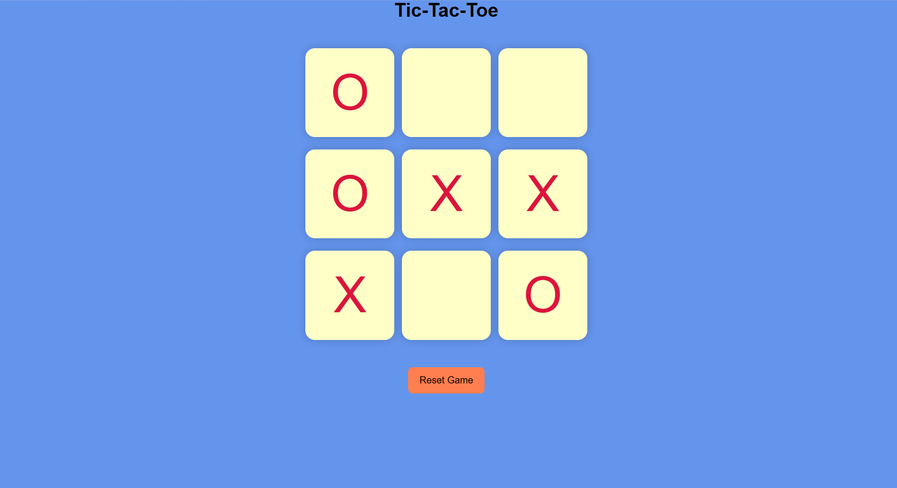
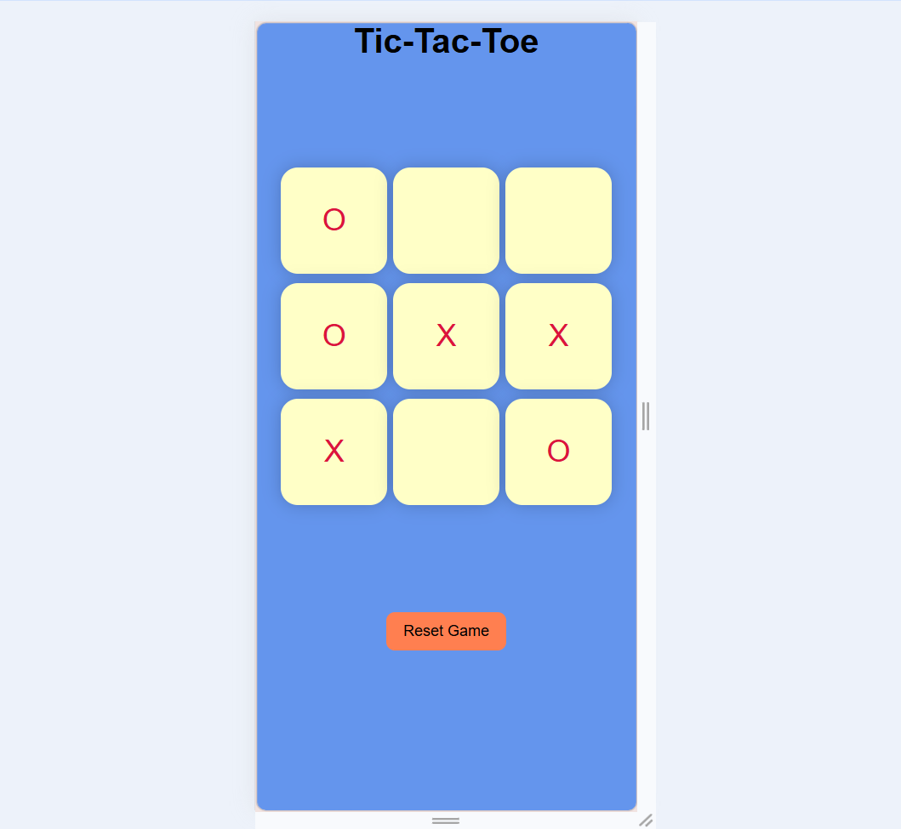
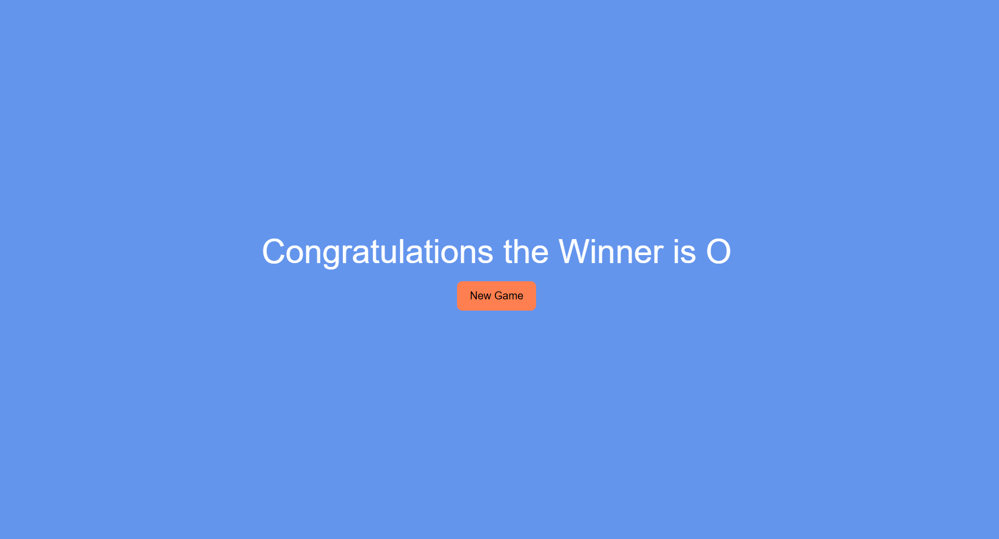

# ❌⭕ Tic-Tac-Toe Game

A simple and interactive Tic-Tac-Toe game built using HTML, CSS, and JavaScript. Play with a friend and enjoy a clean UI with responsive design.

## 🚀 Features

* Two-player gameplay (X vs O)
* Interactive UI with instant updates
* Winner announcement message
* Reset and New Game functionality
* Responsive design (works on mobile 📱)

## 🛠️ Tech Stack

* HTML
* CSS
* JavaScript

## 🎮 How to Play

1. Player X starts the game
2. Players take turns marking the grid
3. First to align 3 symbols (row, column, or diagonal) wins
4. Click **Reset** or **New Game** to play again

## 📸 Screenshots

## 📂 How to Run Locally

1. Download or clone the repository
2. Open the project folder
3. Run the `index.html` file in your browser

## 📌 Future Improvements

* Add single-player mode (AI 🤖)
* Add sound effects 🔊
* Improve animations ✨

## 👨‍💻 Author

Ayushi Singh
